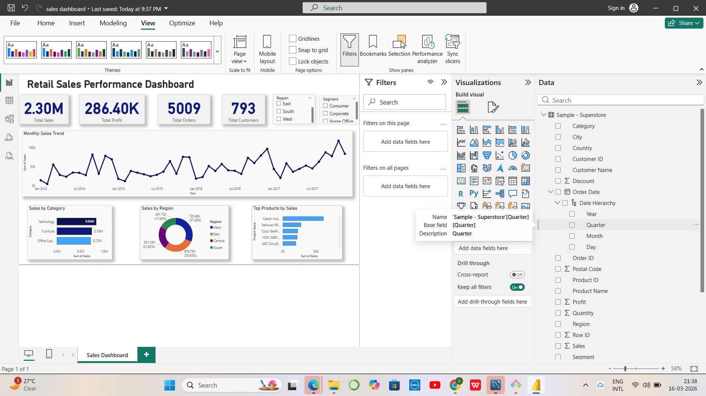
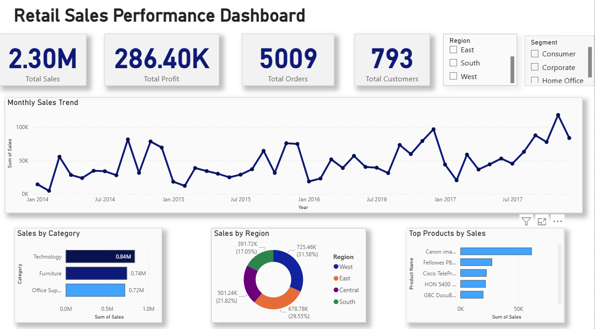

# Retail Sales Performance Dashboard (Power BI)

## Project Overview

This project analyzes retail sales data using **Power BI** to uncover insights about sales performance, customer behavior, and product trends.

The dashboard provides an interactive view of key business metrics such as **Total Sales, Profit, Orders, and Customers**, along with visualizations to track trends and compare performance across categories and regions.

---

## Key Features

* KPI cards displaying total sales, profit, orders, and customers
* Monthly sales trend analysis
* Sales distribution by product category
* Regional sales performance
* Top 10 best-selling products
* Interactive filters for Region and Segment

---

## Tools Used

* Power BI
* Data Visualization
* DAX (Data Analysis Expressions)

---

## Dataset

The dataset used is the **Sample Superstore dataset**, commonly used for sales analysis and business intelligence practice.

---

## Dashboard Preview

### Full Dashboard

### Clean Dashboard View

---

## Insights

* Technology category generated the highest sales.
* West region contributed the largest share of revenue.
* A small number of products drive a large percentage of sales.
* Sales show steady growth with seasonal fluctuations.

---

## Project Objective

The objective of this project is to demonstrate **data analysis and visualization skills using Power BI** and to build a professional dashboard suitable for business decision-making.

---

## Author

Samiksha Singh
